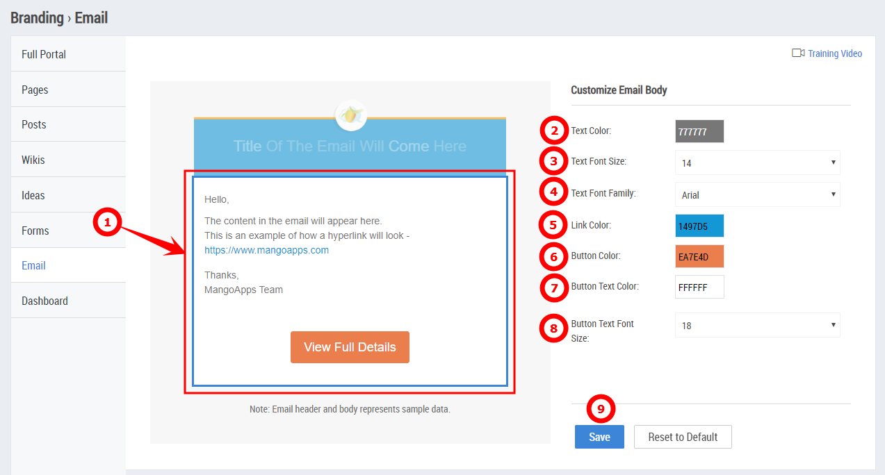

# Email Branding Guide

## Overview

Network admins can configure the look-and-feel of the styles for MangoApps notification emails.

.png>)

1. Click the header section in the email preview to display the _Customize Email Header_ options.
2. Select a background image for the email header.
3. Select the default background color for the content in the email header.
4. Select the default font size for the title text in the email header.
5. Select the default font for the title text in the email header. The available fonts are _Arial, Calibri, Comic Sans, Georgia, Roboto Condensed, Trebuchet MS,_ and _Verdana_.
6. Select the default font color for the title text in the email header.
7. Select the default font color for the text highlighted in the email header. Some words in the title (for example, user name, team names, etc.) are auto highlighted. The value specified here is applied to those highlighted words.
8. Click the **Save** button to apply the changes to the email header.


Click the **Reset to Default** button to overwrite the modifications and restore the system default setting of the email header.


### **Customizing the Email Body**

1. Click the body section in the email preview to display the _Customize Email Body_ options.
2. Select a default text color for all the content within the email body.
3. Select the default font size for all the content within the email body.
4. Select the default font for the content within the email body. The available fonts are _Arial, Calibri, Comic Sans, Georgia, Roboto Condensed, Trebuchet MS,_ and _Verdana_.
5. Select the default color for all URL links within the email body.
6. Select the default color for all the buttons within the email body.
7. Select the default font color for text within buttons in the email body.
8. Select the default font size for the content within the buttons in the email body.
9. Click the **Save** button to apply the changes to the email body.


Click the **Reset to Default** button to overwrite the modifications and restore the system default setting of the email body.

