# Image Recommendations

### Profile Photo

> Recommended size: 250 x 250 px

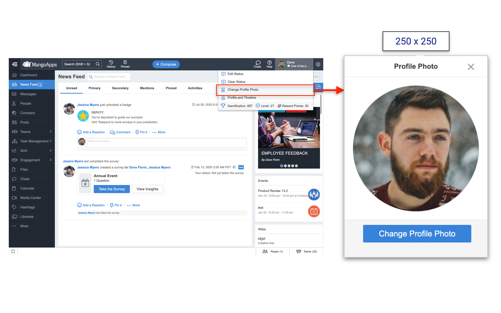

### Event Photo/Icon

> Recommended size: 250 x 250 px

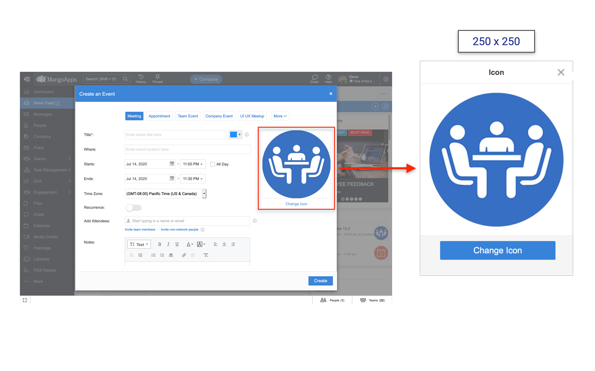

### Company Banner Image

> Recommended size: 1980 x 180 px

### Top Banner Image

> Recommended size: 1903 x 104 px

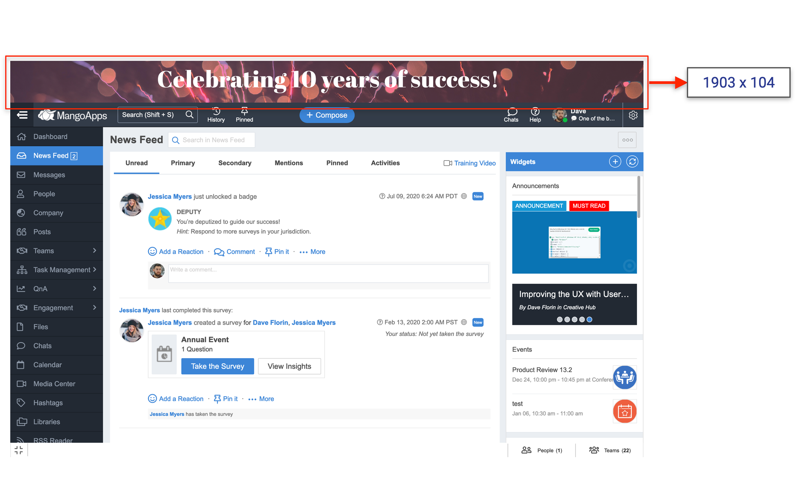

### Greeting/ Recognition Image

> Recommended size: 600 x 314 px

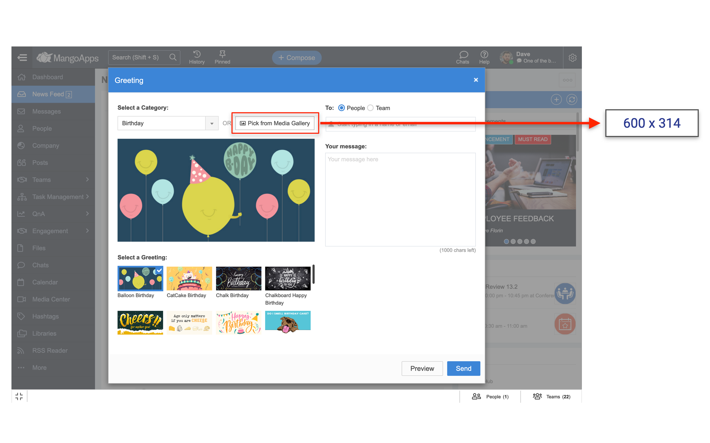

### Group, Department, Project Picture

> Recommended size: 250 x 250 px

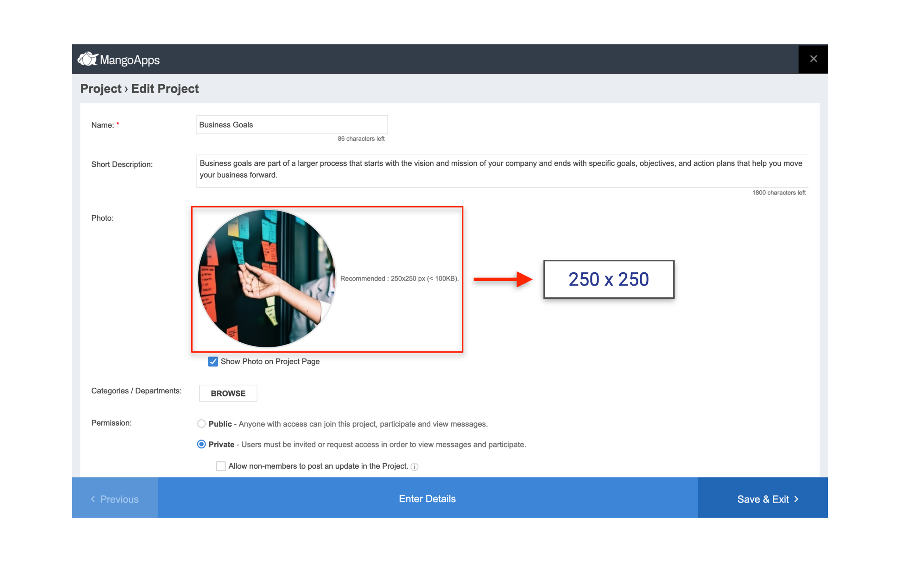

### Configure Group, Department, Project Banner

> Recommended size: 2080 x 108px

### Post - Featured Image

> Recommended size: 1250 x 773 px&#x20;

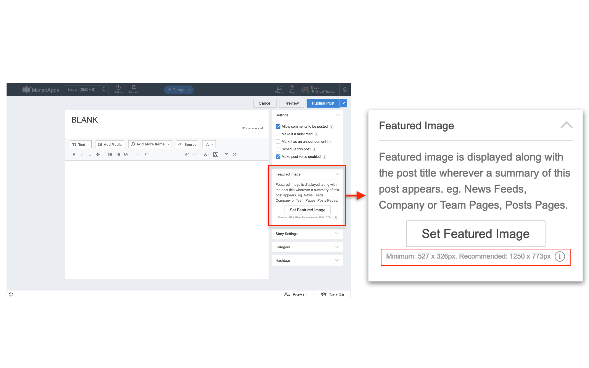

### Post - Story Banner Image

> Recommended size: 1680 x 106 px

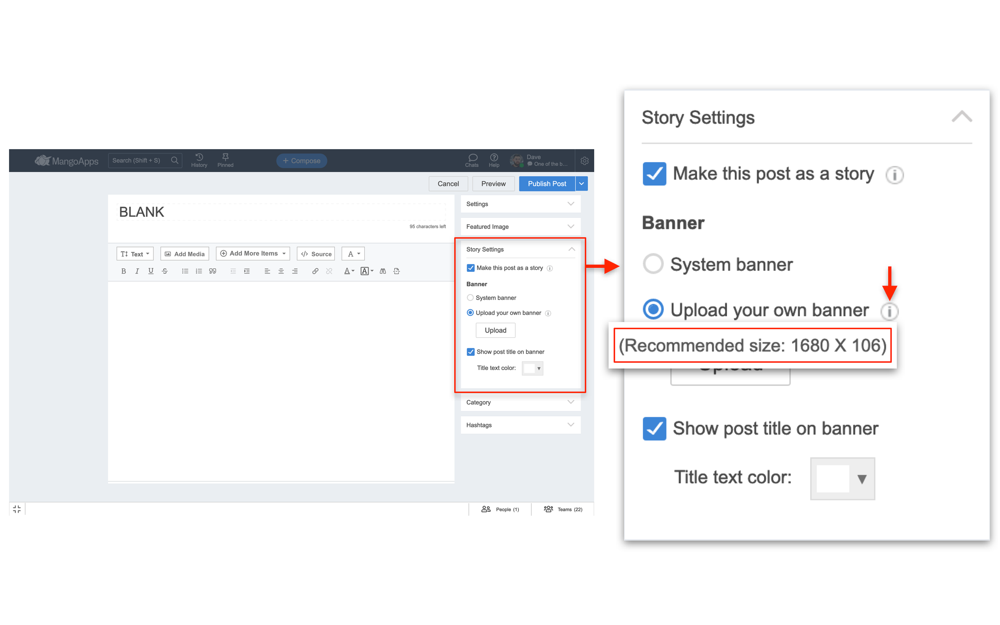

### Post - 'Image' Block

> Recommended size:&#x20;

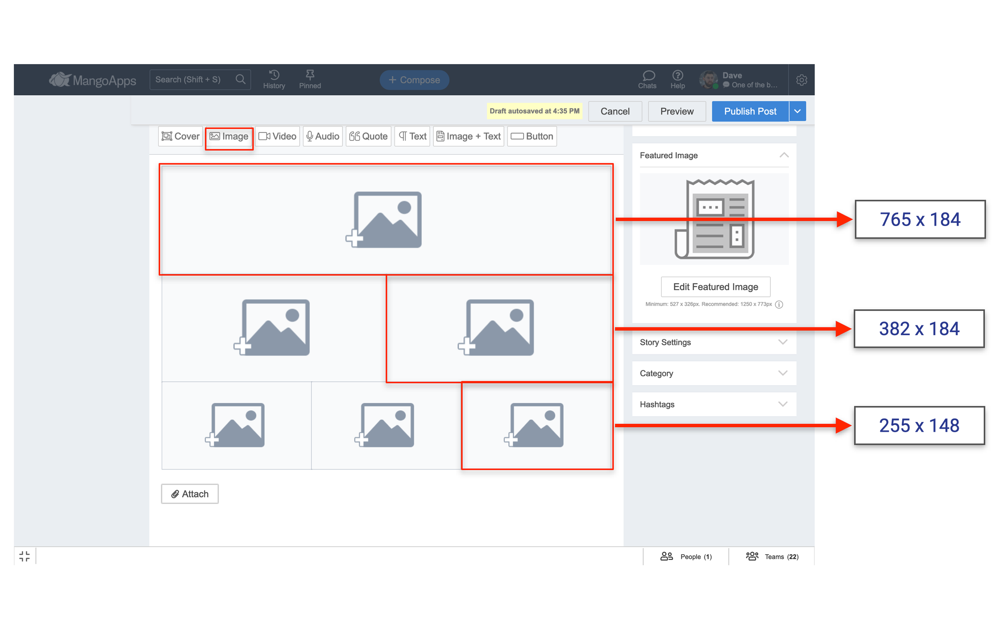

### Post 'Image + Text' Block

> Recommended size:&#x20;

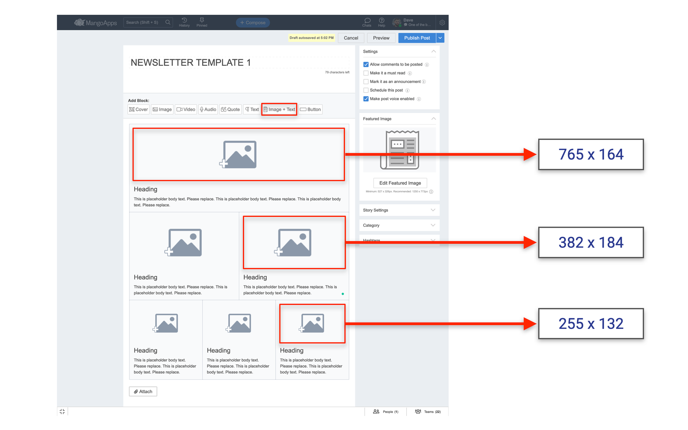

### Logo & Favicon

> Recommended size:  Logo :- 200 x 45 px | Favicon :-  16 x 16 px

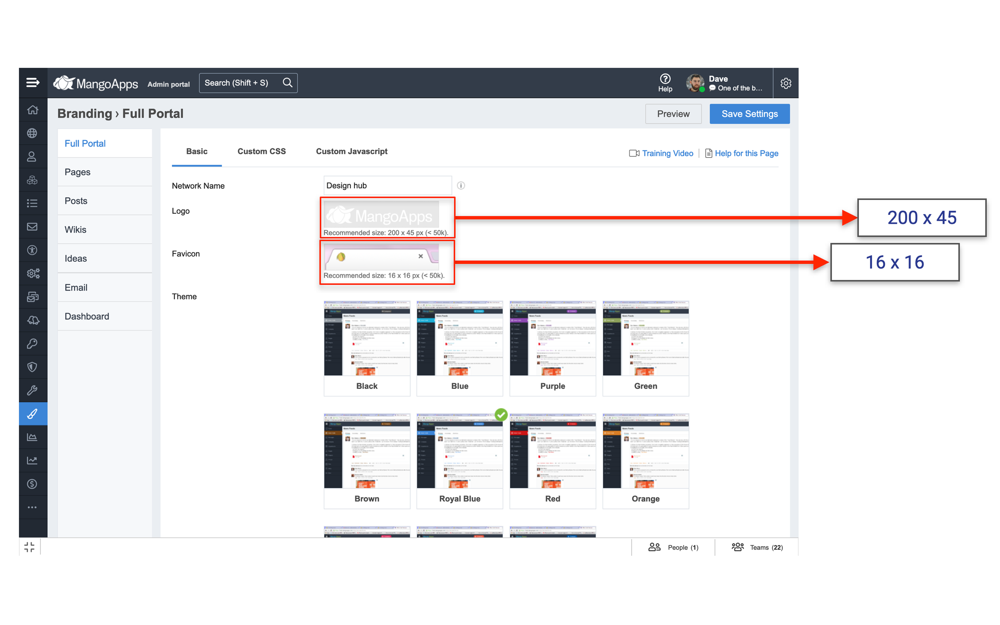

### Banner Configuration

> Recommended size: 1358 x 192 px

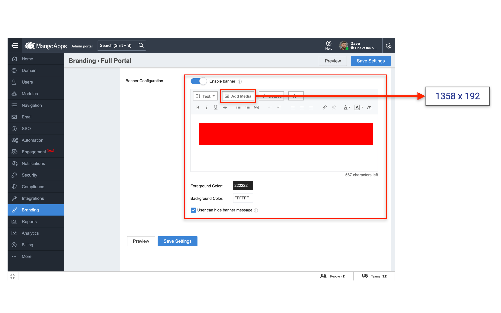

### Media Center - Set Featured Image

> Recommended size: 402 x 248 px

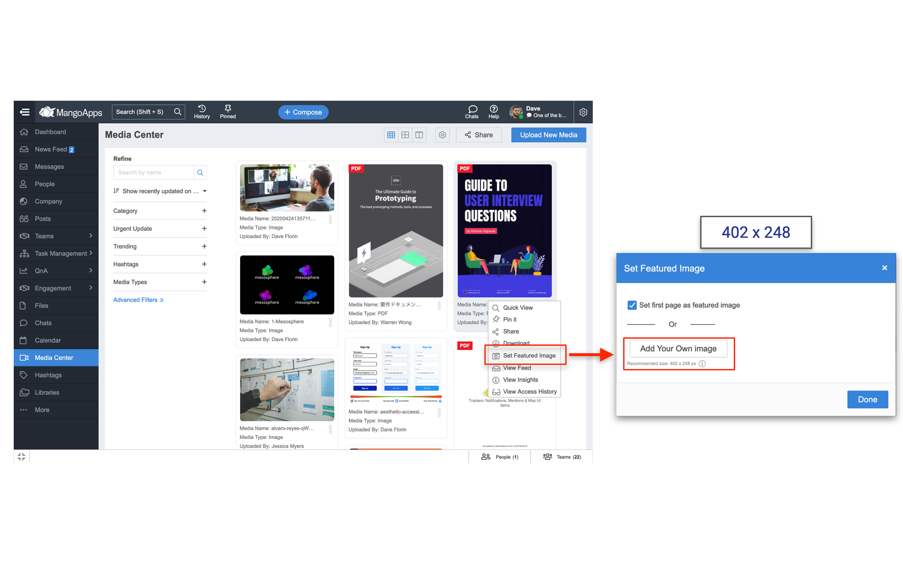

### Tracker Forms - Headers Image/ Logo

> Recommended size: 600 x 200 px

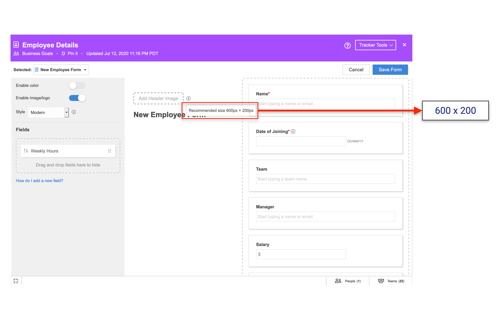

