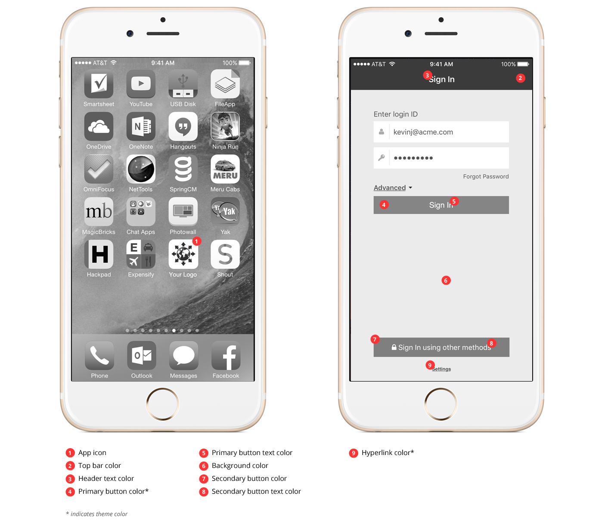
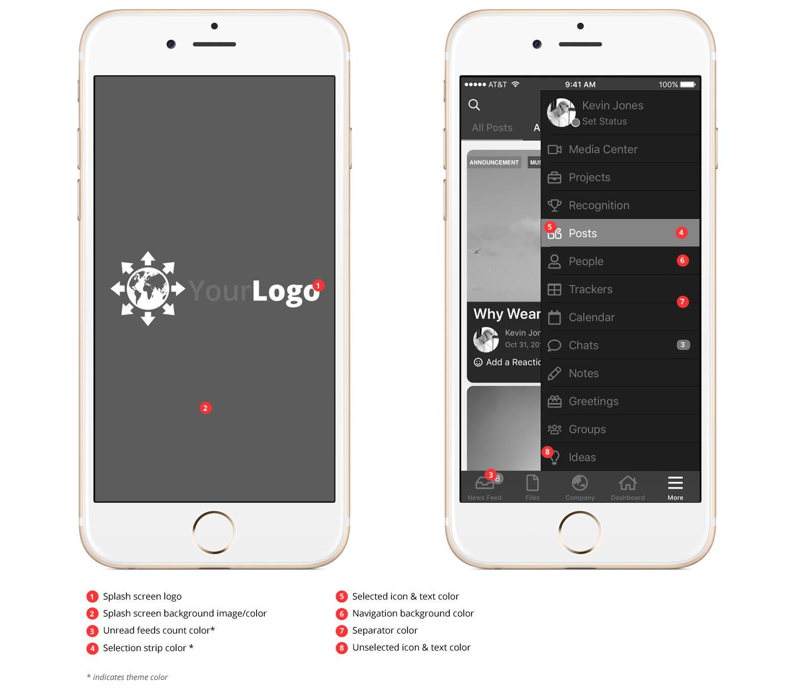
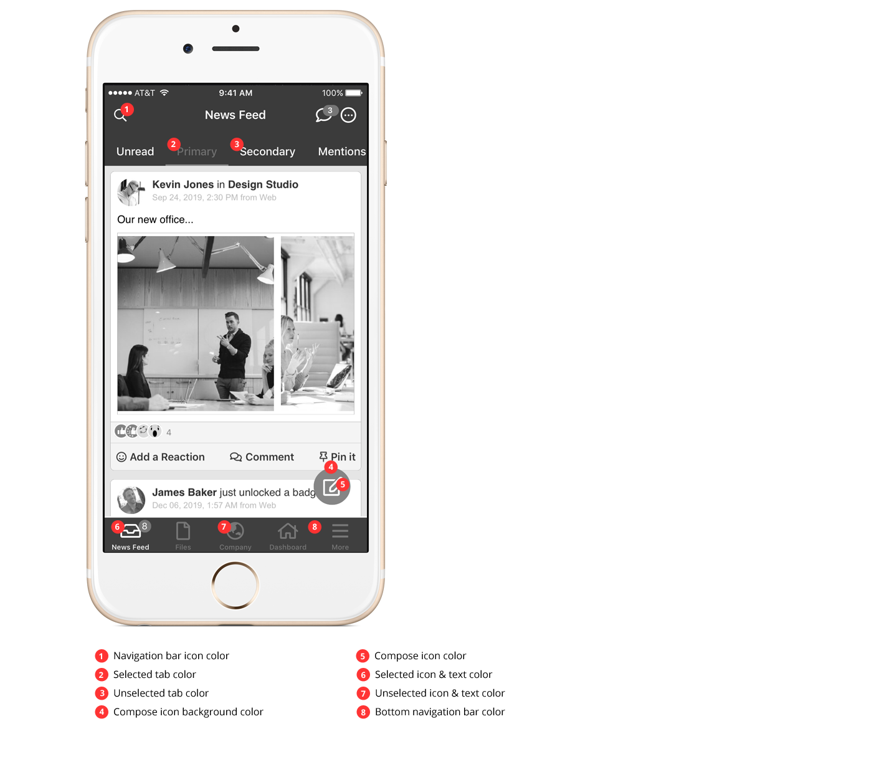
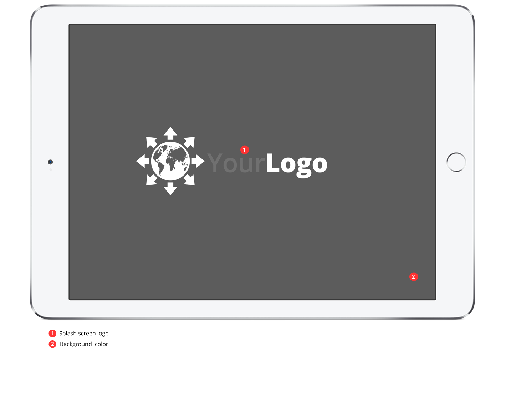
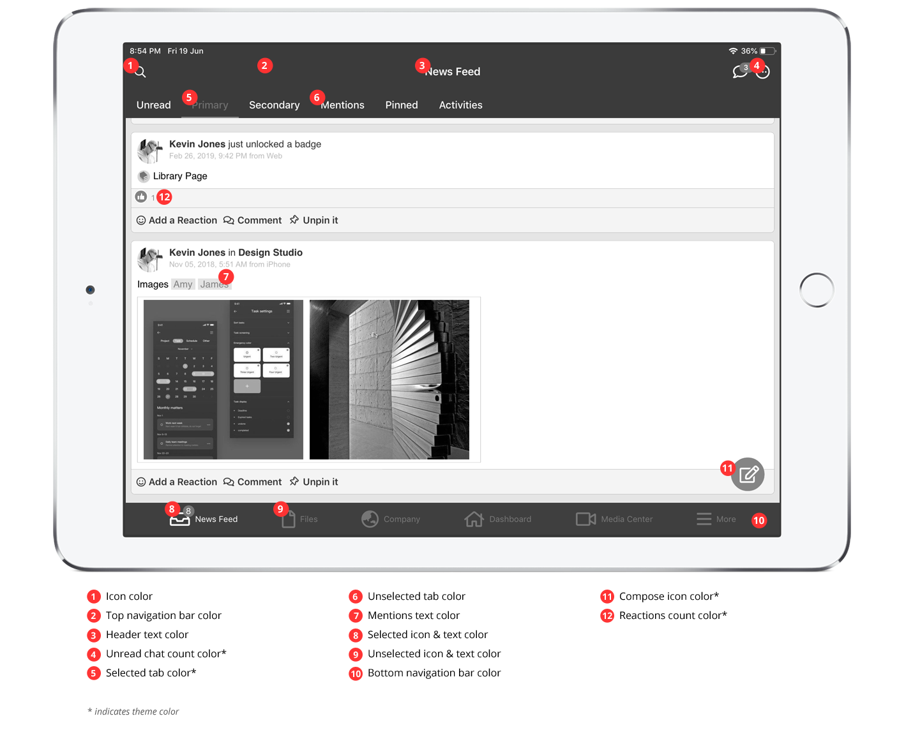
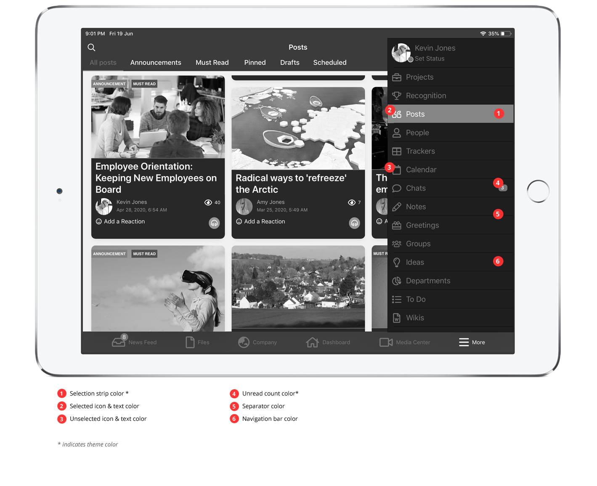
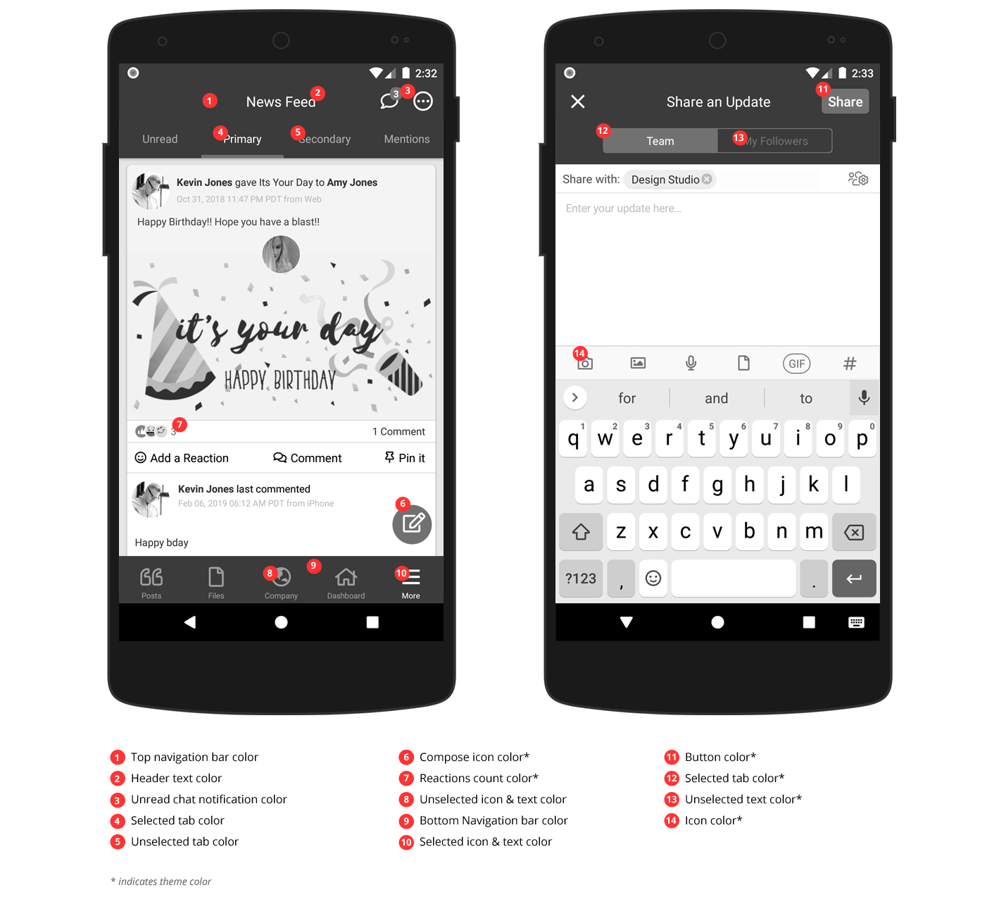

# Mobile Branding Guide

## **What's Branded in the Mobile Applications**

* Your (customer) **application name** will be shown on the Phones’ home screen and on the inside application alerts
* Your (customer) **application icon** will be shown on the Phones’ home screen
* Your (customer) **splash images** will be shown when the application is launched from the installed Phone.&#x20;
* iOS application will automatically be branded to have the title bar and modules as per web branding.

### Example: Branded App icon and Login Page

### Example: Branded Splash screen and LHS navigation

### Example: Branded iPhone News Feed Screen

### Example: Branded iPad Splash Screen

### Example: Branded iPad News Feed

### Example: Branded iPad Post Screen

### Example: Branded Android News Feed and Update

## **Resources Required for Branding Mobile Apps**

**Please provide your company logo (resources) in vector format (.AI, .SVG). Having the resources in native format helps us in creating images in different sizes.**&#x20;

Following resources are required for us to create branded apps:

* Application icon in 1024 x 1024 px (PNG format without transparency)
* Splash images in following sizes (PNG format without transparency)
  * iPhone X and onwards: 1242 x 2688 px (or native psd/ai/vector file that can be resized by our designers)
  * Apple iPad: Portrait: 1536 x 2048 px, Landscape: 2436 x 1125 px (or native psd/ai/vector file that can be resized by our designers)
* The chosen application color codes (in most cases this is the same as what you chose for web branding)

Once the above branding resources provided by you, MangoApps will prepare the branded mobile application mock-up and share it with you for review and approval.

## **Branded iOS Application Distribution Process**

As the custom branded mobile apps for your company are primarily meant for distribution internally to your employees as per Apple's guidelines they do NOT qualify for approval & distribution via the Apple’s public app store. Due to these recent changes made in the Apple’s public app store guidelines, we recommend distributing your custom branded app via one of these two methods:

1. If you have an MDM solution in place, host it on your MDM
2. If you don't have an MDM, we will host it for your on your ManagoApps portal (e.g. [https://hub.mangoapps.com/app\_downloads](https://hub.mangoapps.com/app\_downloads))

For MDM based distribution, please perform the following steps so we can prepare a build for you:

* Invite mobileteam@mangoapps.com to your Apple Enterprise account with an Admin role.  More information on  Apple Enterprise Account can be found here:  [https://developer.apple.com/programs/enterprise](https://developer.apple.com/programs/enterprise/)
* Once you have invited us, we will be able to create provisioning profiles and obtain digital certificates to create your branded iOS builds ready for in-house distribution.
* For each new MangoApps release we will provide branded iOS (iPhone/iPad) application .ipa file to your team for deployment.

For MangoApps portal hosted distribution, you do not need to do anything. We will keep the apps updated and users will be auto prompted to update the app when a new release is available. Your users will download the app directly from your branded site (e.g. [https://hub.mangoapps.com/app\_downloads/mobile/ios](https://hub.mangoapps.com/app\_downloads/mobile/ios)).

If you would still like to try and submit the app for public App store submission, we are happy to do that for you. Please note that we do not have any say over Apple's approval process and even if they approve it at-first they may reject future updates to the app. If you want to give this a try, please get an **Apple developer account  (**[**https://developer.apple.com/programs/**](https://developer.apple.com/programs/)**)**. Once you have the developer account, please invite **mobileteam@mangoapps.com** as an admin user so we can submit the branded iOS app through it for approval.

## **Branded Android Application Distribution Process**

Although, Google does not impose restrictions on what can and cannot appear in Google Play Store, for consistency we recommend that you use the same distribution method for both smartphone platforms. However, if you would like the branded app to be distributed through Google Play store, just let us know and we will do the necessary work. No additional information is needed from you.&#x20;

## **Non-branded iOS and Android App**

Non-branded mobile apps can always be downloaded and used for free from Apple and Google app stores.
